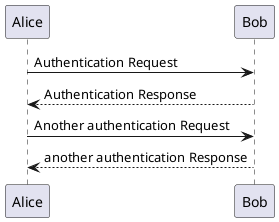
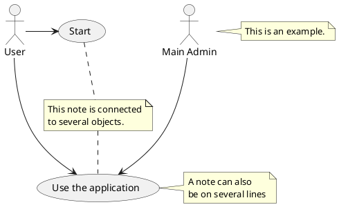
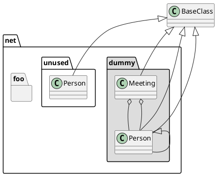
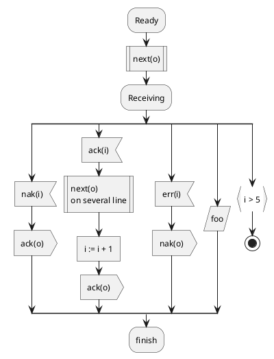

# Plantuml Introduction

## 什么是 PlantUML

首先，引用一段官网的说法

> PlantUML 是一个开源项目，支持快速绘制：
>
> - 时序图
> - 用例图
> - 类图
> - 活动图 (旧版语法在此处)
> - 组件图
> - 状态图
> - 对象图
> - 部署图
> - 定时图
>
> 同时还支持以下非 UML 图:
>
> - 线框图形界面
> - 架构图
> - 规范和描述语言 (SDL)
> - Ditaa diagram
> - 甘特图
> - 思维导图
> - Work Breakdown Structure diagram
> - 以 AsciiMath 或 JLaTeXMath 符号的数学公式
> - Entity Relationship diagram
>
> 通过简单直观的语言来定义这些示意图。

简单的说，PlantUML 定位是用一种比较易读的文字标记来描述各种常用的“图”。

一些例子如下：

简单的时序图

简单的用例图

简单的类图

简单的流程图

具体各种图的例子可以参考其官网
plantuml.com
