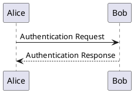

# Plantuml Useage

最无脑的使用方式是使用官网上的在线编辑器[http://www.plantuml.com/plantuml/uml](http://www.plantuml.com/plantuml/uml)

不过我更推荐 VSCode（编辑器）+ PlantUML（VSC 插件）+ Markdown PDF（VSC 插件）+ Markdown Preview Enhanced（VSC 插件，可选）

VSCode 的安装包可以从[https://code.visualstudio.com/](https://code.visualstudio.com)获取。

在 VSCode 的扩展中找到这三个插件：

然后打开 VSCode 的配置文件 settings.json（全局、用户、工作空间皆可），加入下方配置项：

```json
"plantuml.render": "PlantUMLServer",
"plantuml.server": "http://www.plantuml.com/plantuml"
```

这两行配置是告诉 VSCode 和 plantuml 插件“**使用 PlantUMLServer 进行图片的渲染**”，下方是官方的服务器地址。官方给出的一种配置方案是本地运行提供的 java 文件来进行渲染，但是这对于不想安装 java 的人来说是极具劝退性的。而使用官方的服务器可以省去本地配置的一些麻烦之处。

这个时候只要在 Markdown 文件中使用如下格式，便可以在预览界面看到渲染后的图片了。

> 这里说的其实有一点小问题。初次使用时，可能并不会加载内容，VSC 会提示是否要载入不安全的内容。选择**允许不安全的内容**后可以正常显示。不过如果你对安全有较高的要求，可以考虑去装个本地的渲染包。

````markdown

````

这样配置之后，虽然可以显示在 VSCode 的预览里了，但是如何导出呢？这里我推荐使用 Markdown PDF 插件。

打开 VSCode 的配置文件 settings.json（全局、用户、工作空间皆可），加入下方配置项：

````json
"markdown-pdf.plantumlOpenMarker": "```plantuml",
"markdown-pdf.plantumlCloseMarker": "```"
````

这两行是修改 markdown pdf 本身对于 plantuml 渲染的配置。默认的是将从`@startuml`到`@enduml`中的内容渲染。但是前面我们要想在 VSC 中预览须用 markdown 的代码块，因而修改条件为代码块的始末即可。之后使用 markdown pdf 的导出功能即可。

此外，plantuml 插件还支持编辑\*.wsd, \*.pu, \*.puml, \*.plantuml, \*.iuml 等文件格式。